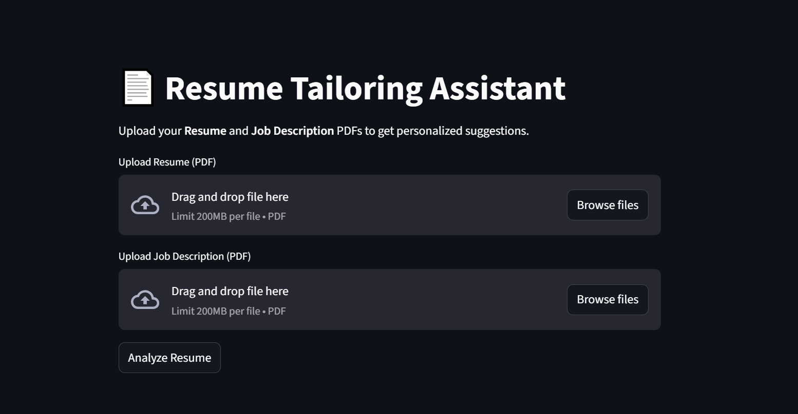
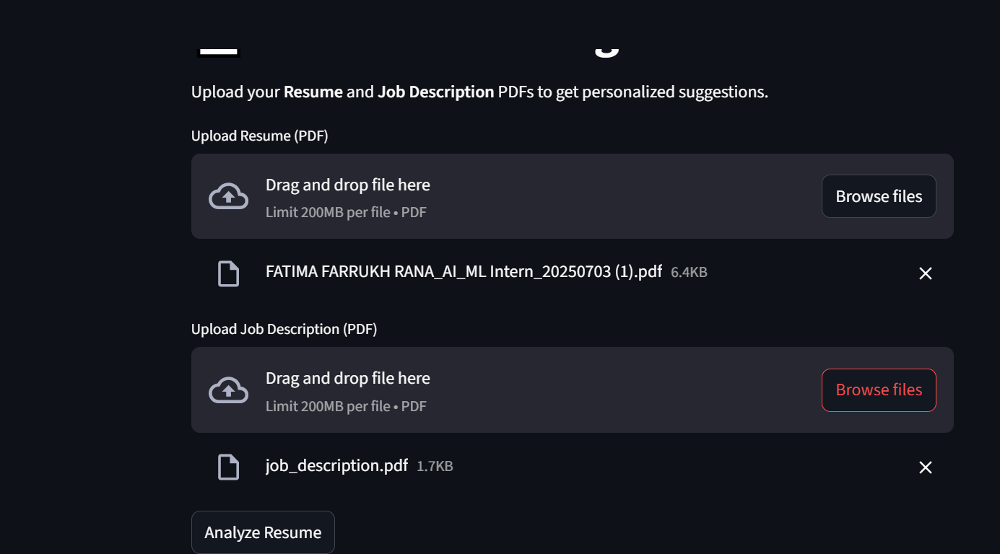
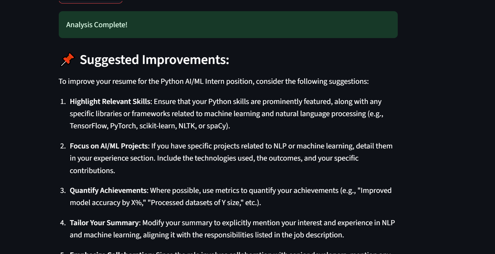
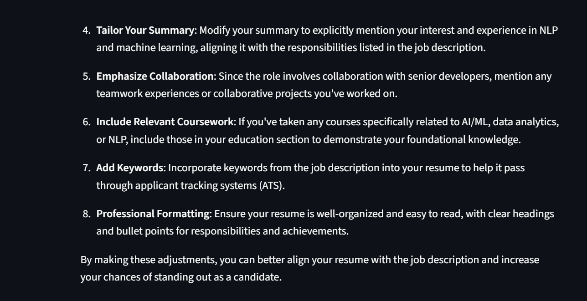

🎯 Resume Tailor – AI-Powered Resume Enhancement
Tailor your resume to specific job descriptions using the power of LLMs!
This tool compares your resume with a given job description and suggests personalized improvements to increase your chances of landing interviews.

🚀 Features
🧠 Uses powerful LLMs via OpenRouter for deep semantic matching

📄 Upload both Resume and Job Description in .txt or .pdf formats

✅ Highlights areas where your resume aligns or needs improvement

📊 Intuitive Streamlit interface – easy for anyone to use

🔐 No data stored – all processing is done in-memory for privacy

🖼 Preview
📌 Home Interface



---

📌 After Uploading Resume & JD



---


📌 Tailored Suggestions Output



---



---


🧑‍💻 How It Works
Upload your resume and job description

The app processes and chunks the content

A Retrieval-Augmented Generation (RAG) pipeline compares them

Suggestions are shown to tailor your resume for the job

📦 Setup Instructions
Clone the repo

```
git clone https://github.com/FatimaRana50/Resume_Tailor.git
cd Resume_Tailor
```
Create virtual environment

```
python -m venv venv
venv\Scripts\activate  # On Windows
```
Install dependencies

```
pip install -r requirements.txt
```
Create a .env file and add your OpenRouter API key:

```
OPENROUTER_API_KEY=your_openrouter_key
```

Run the app


```
streamlit run app.py
```

📁 Project Structure
css
Copy
Edit
Resume_Tailor/
│
├── app.py                      # Main Streamlit frontend
├── resume_tailor_core.py       # Core logic for resume tailoring
├── requirements.txt
├── .env                        # Your API key (not pushed to repo)
├── images/
│   ├── p-3.PNG
│   ├── p-4.PNG
│   ├── p-5.PNG
│   └── p-6.PNG
💡 Future Improvements
Section-based resume feedback

Visual diff highlighting improvements

Export tailored version to PDF

📜 License
This project is open source under the MIT License.
